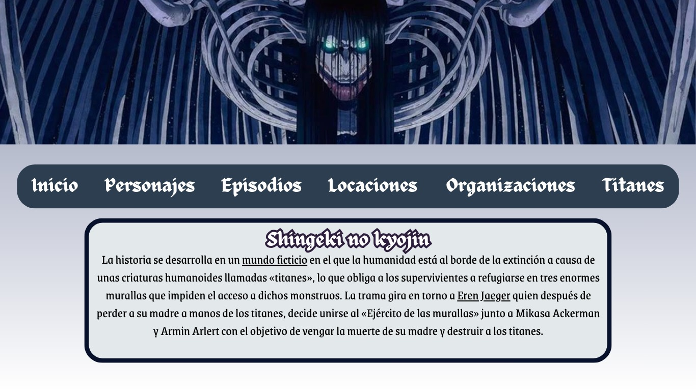
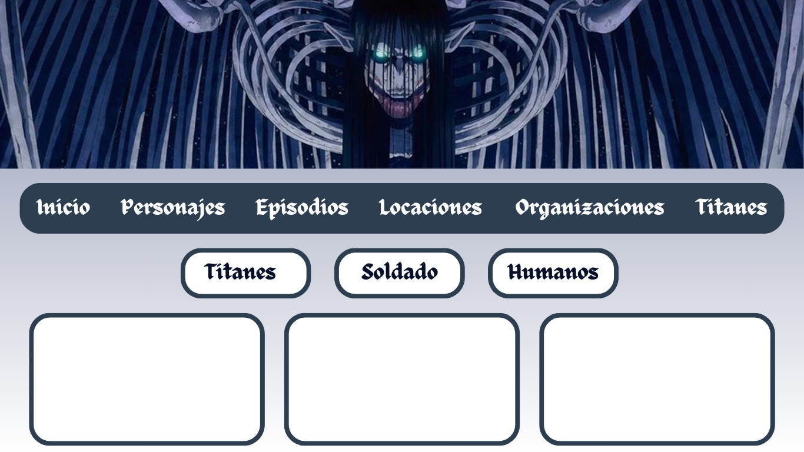

# Mostrando datos de Shingeki no kyojin

## Descripción
Este proyecto tiene la finalidad de mostrar datos a través de Json, haciendo una página web en esta ocasión con la temática del anime "Shingeki no kyojin", para exponer cada parte de este mismo, como los episodios, personajes y titanes y demás información relacionada a este anime para que el público pueda observar y obtener información correspondiente a su interés.

## Tabla de Contenidos
1. [Instalación](#instalación)
2. [Uso](#uso)
3. [Licencia](#licencia)
4. [Agradecimientos](#agradecimientos)

## Instalación 
Para instalar este proyecto en tu dispositivo usa GitHub para descargar el código, haz una carpeta en disco D de tu computadora o laptop, abre Visual Studio Code para pegar el código, linkea las carpetas y/o archivos correspondientes y observa en el servidor nuestro tabajo. Así mismo en GitHub pages puedes visualizarlo con mejor claridad.

## Uso    
Este proyecto puede ser utilizado para ver información de un anime, visualizar cada parte de este mismo, etc; con la finalidad de que las demás personas puedan entretenerse e informarse. A partir de la explicación de la instalación se puede usar el proyecto sin ningún problema.

## Contacto
Nos pueden conocer a través de nuestras cuentas de GitHub y contactar por nuestros correos electrónicos:
selenamagdane@gmail.com
franlimarrero17@gmail.com 
ivannid.n.c@gmail.com

## Notas de la versión 

Título del Proyecto
MOSTRADOR DE DATOS.
¿Qué es? : es un sitio de pagina web que contiene imagenes,textos,videos de tema especifico donde muestra información de datos de tema seleccionada/buscada.
Descripción
TEMA REALIZADA: anime
¿Cómo se llama el anime? : Shingeki no kyojin
Capturas de Pantalla
Boceto:
trabajo:
Instalación
¿ que se hizo en html? : en lo principal primero hemos puesto el icon y el titulo, luego agregamos una imagen del anime en la parte superior y se a puesto el “li” de “personajes”,”temporadas” y agregamos los textos.
¿que se hizo en css? : colocamos el borde del texto y fuente que tambien se realizo texto flotante , por otro lado tambien se uso para modificar e tamaño de la imagen
Uso
solo es aplastar el link de la pagina y se podra ver el contenido
Estructura del Proyecto
en git primeramente creamos una carpeta , en una carpeta de disco y teniendo lista la carpeta creada realizamos lo que es de html,css,java y json
Contacto
grupo:
selena:
(Preguntas Frecuentes)
¿porque el proyecto se realizo de tema anime?
¿
Notas de Versión
Detalles sobre las versiones anteriores y cambios en la versión actual.
Enlaces Útiles
Enlaces adicionales a documentación, tutoriales, o recursos relacionados